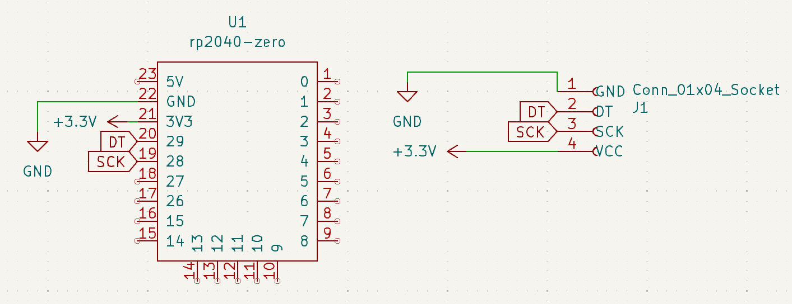

# Dead Simple Thrust Stand

I needed a thrust stand in order to get better data when designing RC aircraft. The bom for this project is as follows:

| Component             | Source | Quantity | Notes                                                                                       |
| --------------------- | ------ | -------- | ------------------------------------------------------------------------------------------- |
| 2KG load cell + HX711 |        | 1        | Larger Load cell recommended for more powerful motors.                                      |
| M4x20                 |        | 2        | Set of varied screw sizes.                                                                  |
| M4x10                 |        | 2        | You can also use M4x20 here.                                                                |
| m2x10                 |        | 2        | Used to mount motor to thrust tower.                                                        |
| 3D Printed Parts      | Self   | 2        | STEP files available here and on printables. PETG recommended as PLA will creep under load. |

the current design is extremely rudimentary and can be described with this schematc:the current design does not use a pcb because of how rudimentary it is. I have included the kicad files regardless for posterity. Future versions may take advantage of it. 

# Code

I hate programming so I wrote the firmware for the thing in circuitpython. that can be found here. It only requires the HX711 library which can be found here. The code includes some rudimentary filtering as well.
